# Mock Evaluation System

A Java web application for managing mock interviews/evaluations, participants, evaluators, batches, technologies, rounds, assignments, scoring and reports.

## Project Objective
The Mock Evaluation System is designed to centralize the management of mock evaluations by allowing administrators to manage batches, technologies, participants, evaluation rounds and evaluator assignments, while enabling evaluators to record scores, feedback and evaluation results.

## Features

### Admin
- Dashboard and system statistics
- Manage users and evaluator accounts
- Manage batches and technologies
- Manage evaluation rounds
- Manage participants and evaluator assignments
- View evaluation, participant, batch, round and technology reports
- View evaluator workload/performance and top performers
- View login activity

### Evaluator
- Evaluator dashboard
- View assigned participants
- Submit and update evaluations
- View evaluation history and reports
- View analytics

### Technical
- Java Servlets and JSP
- JDBC with MySQL
- Maven WAR project
- BCrypt password hashing
- iText PDF report generation
- HTML/CSS/JavaScript
- MVC-style separation using model, DAO, servlet and JSP layers

## Technology Stack

| Technology | Purpose |
|---|---|
| Java | Backend development |
| JSP | Server-side views |
| Servlets | Request handling |
| JDBC | Database connectivity |
| MySQL | Database |
| Maven | Dependency/build management |
| BCrypt | Password hashing |
| iText | PDF report generation |
| HTML/CSS/JavaScript | Frontend |
| Apache Tomcat 9 | Application server |


## Screenshots

### Login Page
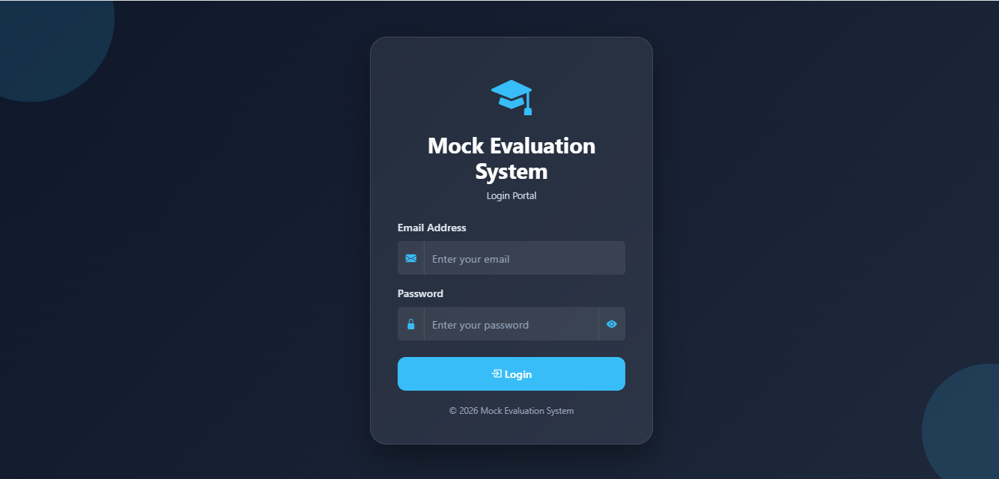

### Admin Dashboard
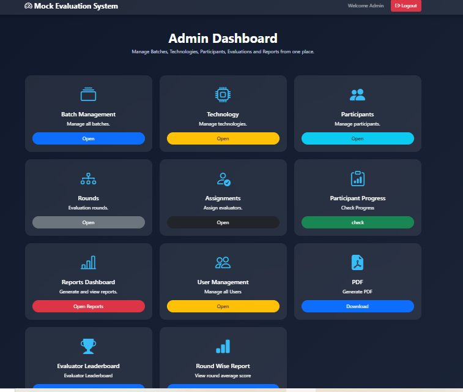

### Batch Management
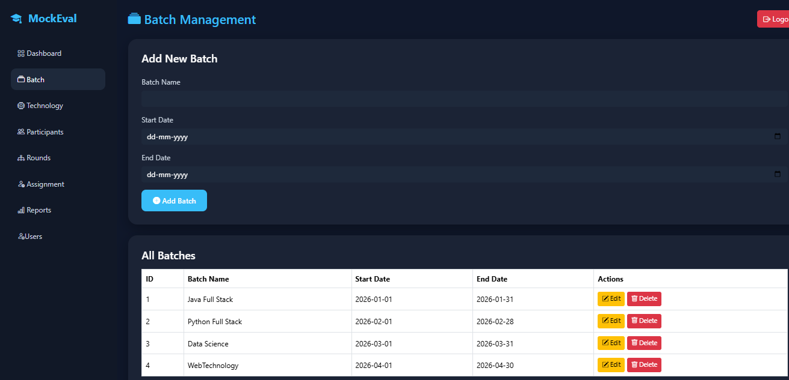

### Evaluator Dashboard
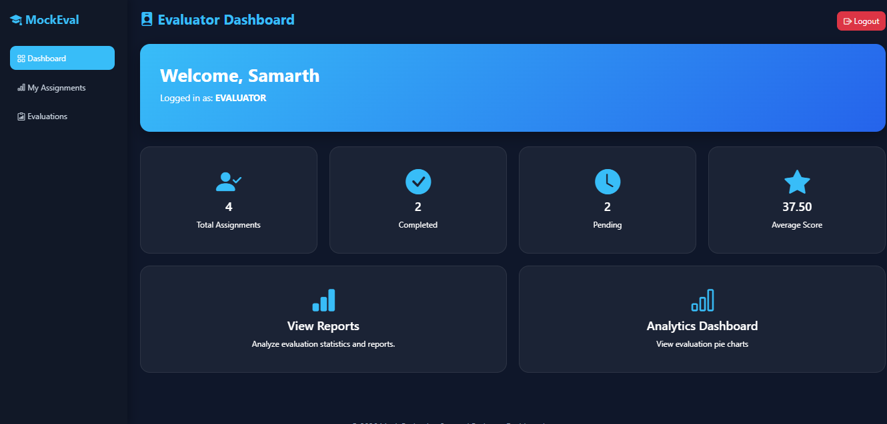

### Evaluator Assignment
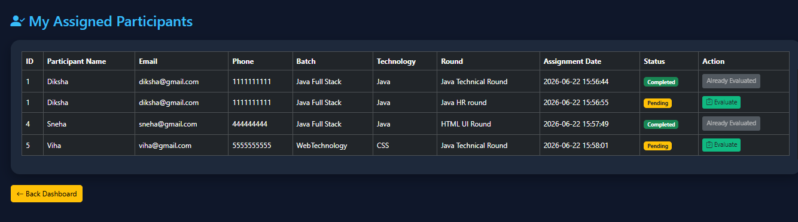

### Participants Details
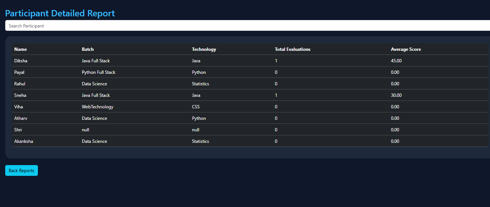

### Evaluation History
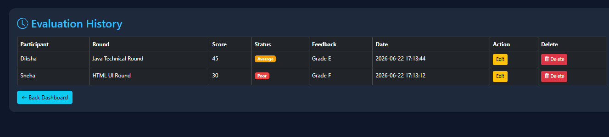

### Evaluation Analytics
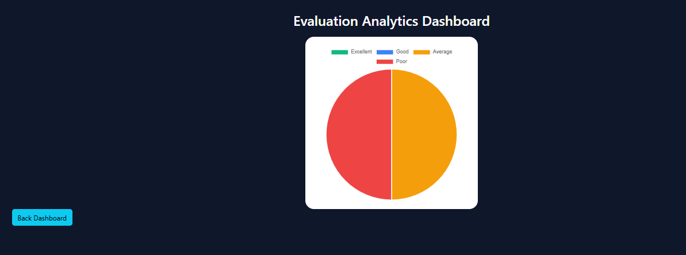

### Reports
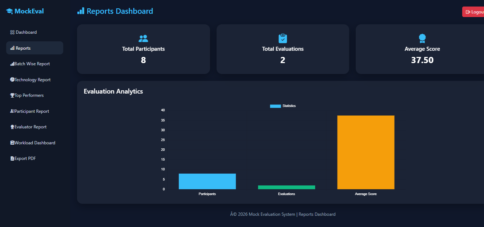

### Workload
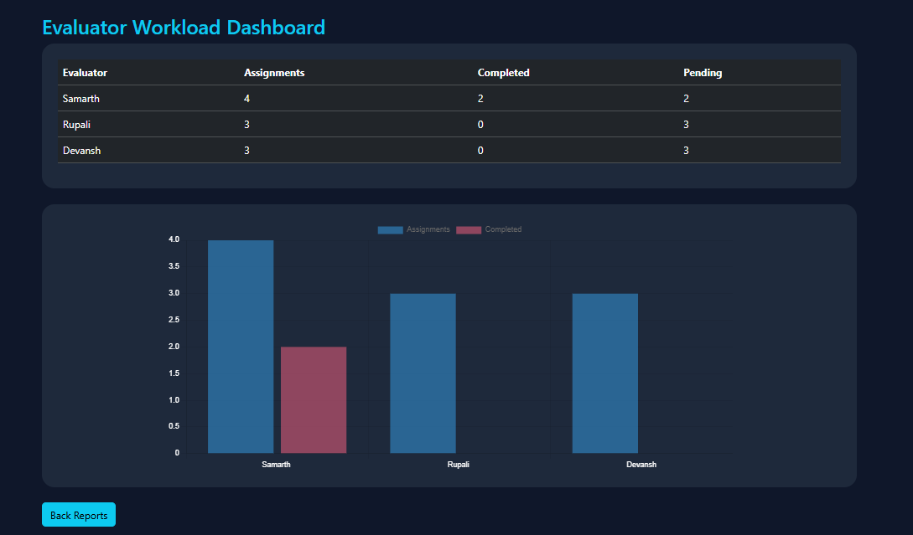

### Export PDF
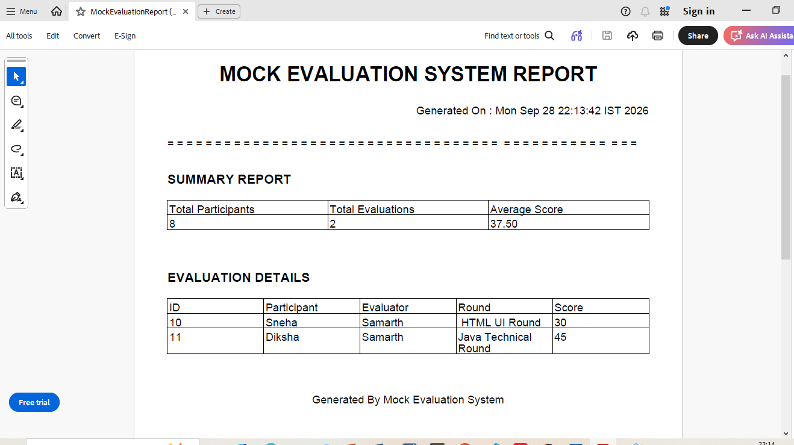

## Project Structure

```text
database/
├── schema.sql       # Database/table creation
└── sample-data.sql  # Optional local demo data

src/main/java/com/mockevaluation/
├── dao/          # Database access classes
├── db/           # Database connection
├── filter/       # Authentication/authorization filter
├── model/        # Entity/model classes
└── servlet/      # HTTP request handlers

src/main/webapp/
├── admin/        # Admin JSP pages
├── evaluator/    # Evaluator JSP pages
├── css/          # Stylesheets
├── js/           # JavaScript
├── WEB-INF/      # Web configuration
└── login.jsp
```

## Prerequisites

- JDK 8 or compatible JDK for this legacy `javax.servlet` application
- Apache Tomcat 9
- MySQL 8.x
- Maven 3.x
- Eclipse/IntelliJ IDEA/VS Code (optional)

## Database Setup

The repository includes the MySQL database scripts in the `database/` directory:

- `database/schema.sql` — creates the database and required tables.
- `database/sample-data.sql` — optional demo data for local testing.

Run `schema.sql` first. Then run `sample-data.sql` if you want the included demo records.

> The sample-data script contains demo-only credentials (`admin@gmail.com` / `admin123` and `evaluator@gmail.com` / `evaluator123`). Do not reuse these passwords for real accounts. For production, use strong unique passwords and the application's BCrypt-based user creation flow.

## Configure Database Credentials

The public repository does **not** contain a database password. Set these environment variables locally:

```text
MOCK_DB_URL=jdbc:mysql://localhost:3306/mock_evaluation_system
MOCK_DB_USER=root
MOCK_DB_PASSWORD=your_mysql_password
```

`mock-evaluation.env.example` is provided as a template. Do not replace the example password with a real password and commit it.

## Run Locally

1. Clone the repository.
2. Configure the three database environment variables above.
3. Make sure MySQL is running and the database/schema is available.
4. Run:

```bash
mvn clean package
```

5. Deploy the generated `target/MockEvaluationSystem.war` to Apache Tomcat 9, or run it from your IDE using a Tomcat 9 server.
6. Open the application in your browser using your local Tomcat URL.

## Security Note

Database credentials are intentionally loaded from environment variables rather than being hard-coded in source code. Never commit real passwords, API keys, tokens or `.env` files to GitHub.

## Future Improvements

- Add automated unit/integration tests
- Add database migration/schema scripts
- Add role-based security improvements
- Containerize the application with Docker
- Add CI/CD with GitHub Actions

##  Author

**Diksha Kashid**

B.Tech – Artificial Intelligence and Data Science

GitHub: [Diksha3004](https://github.com/Diksha3004)
